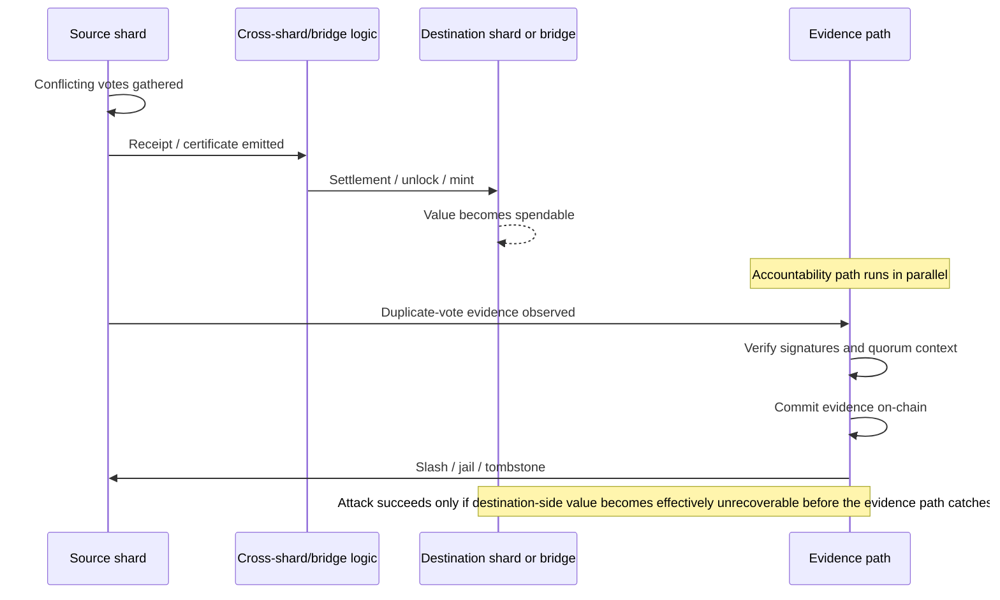

# Critical Review of a Sharding Security Paper Centered on Sub-Threshold Committee Bribery

## Executive summary

The paper has a real, potentially publishable core, but **not in its current form**. The strongest contribution is **Attack 1**, if it is framed narrowly: not as “we discovered bribery,” because blockchain bribery, effective conditional bribery, trustless bribery contracts, and cross-chain bribery are already active research areas, but as a **sharding-specific composition attack** in which an adversary buys just enough **equivocation** inside a revealed shard committee and profits only if **cross-shard or bridge settlement outruns accountability**. That kernel is interesting because prior sharding work typically treats the Byzantine fraction as exogenous, while adaptive-sharding work emphasizes committee capture and reconfiguration rather than the *economic procurement* of faults after committee revelation. But the current draft still looks like a strong position paper or early-stage research draft, not a top-tier acceptance-ready paper: the novelty boundary is under-specified, the cost model is still incomplete, the exploit path is not yet instantiated on a concrete protocol family, and the empirical section appears placeholder-heavy. As submitted now, I would expect **rejection at CCS, IEEE S&P, and USENIX Security**; after a substantial revision focused on Attack 1 alone, **CCS or USENIX Security** look realistic, while **IEEE S&P** is possible but requires the cleanest theory and the strongest evidence. citeturn38view0turn38view3turn49view1turn37view0turn37view1 fileciteturn0file0

## Overall verdict

The most defensible claim is that in a generic shard running quorum-based BFT with committee size `N = 3F + 1`, the attacker may need **strictly less than full corruption** to threaten safety, because **equivocation is a more economical primitive than permanent takeover**. That direction is sound and important. Where the paper is currently vulnerable is in overstating the result: **`F + 1` bought equivocators are the minimum floor needed for conflicting quorums to intersect in faults, but they are not by themselves enough to finalize two conflicting certificates without additional honest votes being split by timing, leader equivocation, or view divergence**. That precision matters a lot; with it, the paper becomes credible. Without it, reviewers will see a consensus mistake. citeturn31view0turn27view2turn30view0

The paper’s strongest publication angle is therefore:

> In sharded systems, **post-membership-reveal conditional bribery** can endogenize the minimum equivocation needed for a shard-level safety break, and **cross-shard settlement or bridge release timing** can make that attack profitable before slashing/accountability completes.

That is a sharper and fairer claim than “we discovered a new bribery attack.” Prior work already studies guided bribery, effective bribery, trustless validator bribery contracts, and cross-chain bribery using smart contracts. Your paper should explicitly position itself as **a new composition of known bribery machinery with shard-local quorum structure and cross-shard latency asymmetry**. citeturn38view0turn38view3turn49view1

Based on the uploaded draft, the paper already points in that direction, but it still reads as if the theorem, economics, and case studies are ahead of the measurements. For a top venue, that is not enough. CCS, USENIX Security, and IEEE S&P all expect novelty, quality of execution, and clear presentation; CCS and USENIX in particular now require strong artifact and open-science handling, and venue ethics expectations are explicit for attack papers. citeturn5view0turn47view3turn47view2turn47view5 fileciteturn0file0

### Summary table

| Dimension | Verdict | Review |
|---|---|---|
| Novelty | **Moderate if narrowed** | Novel as a **sharding-specific economic composition**; weak if claimed as generic bribery discovery |
| Technical correctness | **Promising but delicate** | Quorum-floor claim is basically right if stated as **necessary, not sufficient** |
| Threat model realism | **Plausible but needs instantiation** | Realistic when committee membership is revealed before action and value can exit before evidence lands |
| Empirical adequacy | **Currently insufficient** | Placeholder or synthetic-only evidence is a top-tier killer |
| Ethics | **Manageable with care** | Needs responsible disclosure, non-weaponized artifacts, and explicit dual-use discussion |
| Presentation | **Over-broad today** | One dominant attack is enough; the other four currently dilute the paper |

## Claim-by-claim technical assessment

The key technical claims can be separated cleanly into quorum math, economic modeling, cross-shard timing, and beacon withholding.

### Quorum floor and equivocation mechanics

For a shard using a PBFT-style safety threshold with `N = 3F + 1`, a certificate or commit requires more than `2F + 1` consistent votes, so two conflicting certificates can only coexist if their intersection contains at least `F + 1` faulty signers. Harmony’s whitepaper states the standard PBFT counting rule directly: both prepare and commit complete after `2f + 1` consistent votes in a `3f + 1` setting. Ethereum’s PoS documentation likewise explains that contradictory attestations or multiple proposals are slashable equivocation behaviors, and the consensus spec formalizes double-vote slashability for attestations in the same target epoch. CometBFT’s interchain-security ADR also defines double signing as voting for two different blocks in the same round and explains how duplicate-vote evidence is formed and later punished. citeturn31view0turn27view2turn26view3turn30view0

That means your precision note is correct and should be elevated from a caveat to a theorem statement:

- **Necessary**: at least `F + 1` equivocators must appear in the overlap of two conflicting `2F + 1` quorums.
- **Not sufficient**: each conflicting quorum still needs the remaining votes, which must come from honest validators split across conflicting views, or from additional faulty signers beyond `F + 1`. In the tight case, two conflicting `2F + 1` certificates in a `3F + 1` committee imply exactly `F + 1` equivocators and an even split of the remaining `2F` honest votes across the two branches.

That honest split is not exotic. Ethereum’s PoS documentation explicitly notes that validators can have different views of the head because of **network latency or proposer equivocation**. Your paper should therefore say: **“`F + 1` equivocators are the minimum slashable overlap needed for a safety break; attack completion further requires honest-vote divergence induced by leader equivocation, network delay, or view change.”** citeturn27view2

```mermaid
flowchart LR
    A[Committee membership revealed] --> B[Attacker posts conditional bribe contract]
    B --> C[Targets F+1 validators]
    C --> D[Leader equivocation or delayed messages split honest views]
    D --> E[Validators sign conflicting proposals]
    E --> F[Two conflicting quorum paths gather enough votes]
    F --> G[Cross-shard receipt or bridge settlement releases value]
    G --> H[Equivocation evidence later appears on-chain]
    H --> I[Slashing/accountability executes too late]
```

### Economic profitability

The simplified expression in your prompt,

\[
\Pi = V(1-p_{\text{catch}}) - (t+1)b,
\]

is a useful intuition pump, but it is **too coarse to be the paper’s main equation**. Prior bribery work distinguishes **guided bribing** from **effective bribing**, and shows that incentive equilibria depend strongly on whether bribes are paid for compliant behavior or only for successful attacks. The newer trustless-bribery-contract paper is even closer to your setting: it studies contracts that buy validator behavior conditionally and can fork Ethereum or manipulate RANDAO. So reviewers will expect your model to move beyond a scalar “catch probability” and into explicit timing and incentive terms. citeturn38view0turn38view3

A much better core model for the paper is:

\[
\mathbb{E}[\Pi] = p_{\text{succ}} \cdot p_{\text{win}} \cdot V - \sum_i b_i - C_{\text{op}},
\]

with validator-level participation constraints like

\[
b_i \ge q_i \cdot \big(s_i + R_i + c_i^{\text{opp}}\big),
\]

where:

- `p_succ` = probability the shard-level equivocation path actually gathers the needed conflicting support,
- `p_win` = probability the value exits before accountability lands,
- `q_i` = probability the validator actually suffers slash/enforcement if they equivocate,
- `s_i` = slash exposure,
- `R_i` = foregone honest rewards or reputational costs,
- `c_i^opp` = operational or opportunity cost,
- `C_op` = briber’s execution costs.

This is close to the economic structure your draft is already moving toward, and it is much stronger than the shorthand version. fileciteturn0file0

The most important correction is that **`p_catch` cannot just be thrown into revenue while bribe size is treated as fixed**. In reality, the probability of detection and enforcement affects **both** the attacker’s expected upside and the validator’s minimum acceptable bribe. That matters especially on platforms like Ethereum, where slashing is **correlation-sensitive**: the official Ethereum documentation says the penalty can be minor for a single slashed validator but can scale up to **100% of stake** in mass-slashing events. So a linear bribe-budget term `(F+1)b` may materially understate cost in systems with convex or correlated slashing. citeturn27view1turn27view2

The Cosmos Interchain Security ADR is also useful evidence that timing matters operationally: the old governance-based equivocation path could take weeks, while the ADR proposes automatic verification “immediately upon receipt of evidence.” That does not prove your attack, but it strongly supports your paper’s premise that **evidence latency and enforcement latency are central system parameters, not side notes**. citeturn30view0

The following figures are the kind of **model-driven, not yet empirical** plots the paper should include. I generated them from the draft’s current economic structure as **illustrative placeholders**; in a submission, these must be replaced or supplemented by measured protocol parameters. fileciteturn0file0

For a homogeneous illustrative example with slash cost normalized to `1`, foregone reward `R = 0.5`, and enforcement probability `q ∈ {0.25, 0.5, 1.0}`, the total minimum bribery budget

\[
B = (F+1) q (s+R)
\]

looks like this:

| Committee size `N` | Fault threshold `F` | Minimum equivocators `F+1` | `B` at `q=0.25` | `B` at `q=0.5` | `B` at `q=1.0` |
|---|---:|---:|---:|---:|---:|
| 16 | 5 | 6 | 2.25 | 4.50 | 9.00 |
| 25 | 8 | 9 | 3.38 | 6.75 | 13.50 |
| 34 | 11 | 12 | 4.50 | 9.00 | 18.00 |
| 64 | 21 | 22 | 8.25 | 16.50 | 33.00 |
| 100 | 33 | 34 | 12.75 | 25.50 | 51.00 |

This table is useful as **a sensitivity display**, but it should **not** be used to claim that “real sharded systems use 20–30 node committees.” Classic sharding papers often push committee sizes upward for security. ELASTICO explicitly describes committees as “a few hundred” identities, and Harmony’s whitepaper also discusses shard committees in the hundreds and stresses reshuffling against adaptive corruption. So the “small committees ≈20–30 make the budget tiny” narrative is at best **protocol-dependent** and cannot be asserted as a general fact without case-study evidence. citeturn20view1turn31view0

### Cross-shard accountability race

This is the paper’s best systems insight, but it needs a concrete target model.

Sharded ledgers rely on **additional cross-shard coordination** to preserve atomicity when inputs and outputs span shards. The Byzcuit replay-attack paper explains this clearly: the relevant shards run a two-phase-style cross-shard protocol, often with local tentative writes and locks before a final commit. That paper also shows that cross-shard protocols can lose safety or liveness even when shards are honest, which supports your decision to foreground cross-shard composition rather than only intra-shard consensus. Bridge SoKs likewise emphasize that bridges usually involve contracts that **hold and release digital assets**; once assets are released on the destination side, accountability on the source side may be economically too late. citeturn35view0turn49view0

What this means for your paper is:

- The race is **plausible** if a shard safety failure can emit a receipt, unlock a bridge, or settle a cross-shard dependency **before** equivocation evidence is finalized and enforced.
- The race is **not universal** if receipts are gated on stronger finality, bridge release is delayed past the accountability window, or evidence handling is near-immediate.

That is exactly why the paper should avoid saying “cross-shard effects automatically imply `p_catch < 1`.” The right statement is narrower:

> The attack needs a protocol instance in which **value finalization or irreversible release** can occur before **evidence propagation, verification, and slash enforcement** complete.

That turns the contribution into a systems-security result rather than a slogan. citeturn35view0turn30view0turn49view0

The paper should then explicitly parameterize the race with measurable latencies such as `T_settle`, `T_evidence`, `T_slash`, and `T_unbond`, instead of relying on a single abstract `p_catch`. This is one place where the draft’s current conceptual framing is good, but the evaluation is not yet complete. fileciteturn0file0

### Beacon withholding as amplifier

This is the weakest of the four highlighted claims you asked me to verify.

Ethereum’s consensus spec shows that the proposer’s `randao_reveal` is mixed into the current randomness state during block processing, so proposer behavior directly affects beacon randomness evolution. Recent papers then go further: one analyzes the “last revealer” bias in Ethereum’s RANDAO, another derives optimal RANDAO manipulation, and another shows that **sub-1/3** stakeholders can carry out low-cost reorg and finality-delay attacks by withholding blocks and attestations. In other words, the broader idea that **withholding or selective participation can bias or delay beacon outcomes** is already established. citeturn26view0turn26view1turn42academia0turn42academia1turn42academia2

So I would not headline “beacon withholding amplifier” as a novel result unless you can prove a **specific sharded reconfiguration effect** that is not already subsumed by existing randomness-bias or withholding work. The strongest version would be a concrete protocol where:

- beacon output is required to reshuffle committees,
- missing that output triggers a **reuse-previous-assignment** fallback,
- the adversary can stall beacon liveness with less power than is needed to capture consensus,
- and that stall provably extends a vulnerable assignment long enough to increase the probability of Attack 1.

Absent that, I would demote this to **secondary amplifier / future work** rather than a main theorem. The idea is plausible; the novelty is much weaker than for Attack 1. citeturn26view0turn42academia2

## Novelty against prior art and against the other four attacks

The paper will be judged first on whether it **respects prior art**. On that front, the review is mixed.

On the positive side, prior sharding work really does focus mainly on committee formation, adaptive corruption, reshuffling, and cross-shard atomicity, not on the post-reveal *economic purchase* of just enough equivocation. Divide & Scale proves that sharding cannot scale under a fully adaptive adversary and identifies epoch-adaptive conditions for scaling; Free2Shard is motivated precisely by the lack of robustness of many sharding protocols to adaptive corruption. That makes your paper’s “endogenize the faults after membership revelation” angle meaningful. citeturn37view0turn37view1

On the negative side, bribery itself is not new. Recent work already formalizes PoS bribing attacks against blockchain safety, distinguishes guided from effective bribing, and studies counterincentives. Another recent paper explicitly implements **trustless bribery contracts** against Ethereum validators, including a contract that buys votes to fork the chain and a market for manipulating RANDAO. Cross-chain bribery contracts are also already in the literature. So if the current manuscript claims novelty at the level of “conditional on-chain bribes can buy consensus faults,” reviewers will rightly reject that claim. citeturn38view0turn38view3turn49view1

The right novelty claim is narrower and stronger:

> Prior work studies bribery against consensus generally; this paper identifies a **sharding-specific leverage point** where **committee revelation + quorum-intersection economics + cross-shard settlement latency** make **one-shot equivocation procurement** a cheaper route to value extraction than permanent committee corruption.

If you sell *that*, the paper has a defensible point of departure. If you sell “new bribery attack,” it does not. citeturn35view0turn37view0turn38view3

The other four attacks are presently less submission-ready than Attack 1.

- **Attack 2, reflexive beacon-committee capture** overlaps substantially with existing randomness-bias and RANDAO-manipulation work. It may still contain a sharding-specific self-reselection angle, but that angle is not yet isolated sharply enough to carry a top-tier paper on its own. citeturn42academia0turn42academia1turn38view4
- **Attack 3, small-committee DA-sampling false-accept**, is interesting only if you pin it to **committee-scoped DA sampling**. It does **not** transfer to Ethereum’s modern roadmap, because Ethereum explicitly moved away from classical shard chains and now uses distributed data sampling across blobs; validators sample globally rather than relying on one small shard committee for soundness. citeturn46view2turn46view3
- **Attack 4, beacon-liveness withholding freeze**, overlaps with known withholding/finality-delay behavior and needs a concrete fallback-based reshuffle-freeze mechanism to be more than a design warning. citeturn42academia2turn26view0
- **Attack 5, cross-shard fee-market latency arbitrage**, is clever but presently too forward-looking. It depends on divergent per-shard fee markets in a way that is not reflected in Ethereum’s current danksharding roadmap, which no longer uses classical shard chains. As a standalone idea, it feels more like a workshop or position-paper topic unless you attach it to a live or imminent design. citeturn46view2

My clear recommendation is therefore: **make this one paper about Attack 1** and, at most, keep attacks 2–5 as a short “research directions / extensions” section. The uploaded draft appears to already move in that direction, and that is the right instinct. fileciteturn0file0

## Empirical adequacy, ethics, and presentation

The current empirical story is the biggest obstacle to publication.

For CCS and USENIX Security, this is especially serious because both venues now place real weight on open science and evaluation artifacts. CCS 2026 requires an Open Science appendix, anonymous artifact availability close to submission, and an Ethical Considerations appendix for work with real-world attack implications. USENIX Security ’26 requires an Open Science appendix, an Ethics appendix, and expects artifacts to be available at submission time unless there is a justified reason not to release them. IEEE S&P 2027 is somewhat less artifact-centric in the CFP, but it explicitly flags “attacks with novel insights” and “blockchains and distributed ledger security” as in scope, and it requires ethics disclosures; for accepted papers, ethics language becomes part of the manuscript. citeturn48view0turn47view3turn47view2turn6view0turn47view5

That venue context matters, because a paper of this kind cannot survive on algebra alone unless the theory is extraordinarily sharp. Right now, your draft still appears to rely too heavily on synthetic or placeholder-style evidence. For a top-tier submission, you need at least one of the following, and preferably both:

- a **proof-quality analytical model** with protocols, assumptions, and race conditions formalized tightly enough that there is little ambiguity left, and
- a **systems evaluation** on a concrete prototype or event-driven simulator calibrated to one or more actual protocol families.

Without that, reviewers will likely respond: *interesting idea, incomplete validation*. fileciteturn0file0

### Strengths, weaknesses, and fatal flaws

| Category | Assessment |
|---|---|
| Strengths | Strong attack intuition; good focus on **endogenous procurement of faults**; clear connection between quorum intersection and economics; timely intersection of blockchain security and security economics; actionable mitigation space |
| Weaknesses | Draft currently over-bundles multiple attacks; novelty is narrower than current wording suggests; empirical grounding is not yet convincing; committee-size assumptions are too generic; profitability model is still under-specified |
| Fatal flaws if unaddressed | Claiming novelty for bribery itself; keeping placeholder evaluation; failing to instantiate one concrete cross-shard/bridge race where settlement beats accountability; leaving `F+1` presented as if it were sufficient |

Ethically, the paper is publishable if handled carefully, but it is definitely **dual use**. A responsible version of the paper should **not** release a live bribery-market contract ready for production deployment against public chains. Instead, artifact release should prioritize:

- local-testnet or simulator-only code,
- redacted or inert contracts,
- parameter-extraction scripts,
- mitigation experiments,
- and, if a live protocol family is concretely implicated, responsible disclosure timelines.

That is well aligned with the current venue ethics guidance. citeturn48view0turn47view3turn47view5

## Venue fit and publication prospects

As of the official pages I could verify, **CCS 2026** and **USENIX Security ’26** deadlines have already passed, while **IEEE S&P 2027** currently lists a first deadline of June 11, 2026 and a second deadline of **November 17, 2026**. CCS 2026 has a dedicated **Blockchain and Distributed Systems** track; USENIX Security ’26 and IEEE S&P 2027 both explicitly include **blockchains and distributed ledger security** in-scope. CCS does **not** accept SoK papers; IEEE S&P and USENIX Security both do. citeturn48view1turn48view3turn7view4turn6view0turn5view0

### Venue recommendation table

| Venue | Fit | Honest assessment |
|---|---|---|
| CCS | **Best fit for a focused Attack 1 systems-security paper** | As-is: reject. After major revision: realistic target when the next CFP opens |
| USENIX Security | **Also a strong fit, especially if artifact-heavy** | As-is: reject. After a strong simulator/prototype and clear attack evaluation: realistic |
| IEEE S&P | **Fit is good, bar is highest** | As-is: reject. Revised: possible, but only with the cleanest theorem statements and strongest evidence |

My realistic venue judgment is:

- **As-is**: I would not submit to any of the three.
- **After a major revision focused on Attack 1 only**:
  - **CCS**: strongest match.
  - **USENIX Security**: very plausible if you deliver a polished artifact and systems evaluation.
  - **IEEE S&P**: stretch target, but still credible if you elevate the work from “attack idea + toy model” to “tight theorem + concrete exploit path + measured mitigation study.”

### Submission timeline

Because the necessary work is substantial, the **realistic currently posted official target is IEEE S&P 2027 second cycle on November 17, 2026**. CCS 2026 and USENIX Security ’26 are already closed. citeturn6view2turn48view1turn7view4

A practical schedule from now would be:

| Window | Goal |
|---|---|
| Next two weeks | Cut attacks 2–5 down to a short extensions section; rewrite theorem statements; lock one or two protocol families |
| Next month | Build the event-driven simulator or prototype; extract concrete timing parameters; produce the exploit and mitigation plots |
| Following month | Add one real case study table, one mitigation section, and one ethics/disclosure plan; package anonymized artifacts |
| Final month | Rewrite abstract/introduction to avoid overclaiming; get skeptical feedback from at least two security researchers; polish for top-tier review |

If that slips, the next sensible move is to target **CCS 2027 or USENIX Security 2027 when their official CFPs are posted**, rather than rushing a weak version. citeturn6view2turn48view1turn7view4

## Prioritized revision roadmap

This is the concrete roadmap I would follow.

### Required fixes before any top-tier submission

The paper needs the following changes before it is even worth sending out:

| Priority | Fix | Why it matters |
|---|---|---|
| Highest | Make Attack 1 the only primary contribution | Multiple speculative attacks dilute novelty and confidence |
| Highest | State the quorum result as **necessary, not sufficient** | Prevents a consensus-correctness rejection |
| Highest | Replace the shorthand profit equation with a full expected-profit model | Reviewers will attack the current modeling simplification |
| Highest | Instantiate one concrete protocol family with measured timing assumptions | Otherwise the cross-shard race remains too abstract |
| Highest | Replace placeholder evaluation with real plots from a simulator/prototype | Top-tier reject otherwise |
| High | Narrow the novelty claim to sharding-specific composition | Avoids prior-art rejection |
| High | Add mitigation evaluation, not just mitigation prose | Security venues want actionable defenses |
| Medium | Demote attacks 2–5 to extensions or future work | Keeps the paper coherent and believable |

### Experiments and analyses to add

The paper should add four classes of evidence.

First, add a **quorum-construction proof**. A concise lemma plus corollary is enough:

- Lemma: in a `3F+1` committee with a `2F+1` certificate threshold, any two conflicting certificates intersect in at least `F+1` validators.
- Corollary: a safety break requires at least `F+1` equivocators.
- Proposition or theorem: `F+1` alone does not suffice unless honest votes are split across conflicting views.

Second, add a **timing-calibrated exploit simulator**. The simulator does not need full production fidelity; it does need to explicitly model:

- committee revelation,
- bribe posting,
- leader equivocation or delayed-message schedules,
- evidence creation and inclusion,
- slash enforcement,
- cross-shard settlement or bridge release.

Third, add **case-study instantiations**. At minimum, one table should cover protocol families and tell the reader where Attack 1 could or could not apply. The table I would want to see has these columns:

| Protocol family | Committee revealed before action? | Intra-shard threshold | Evidence path | Unbonding / exit lag | Cross-shard / bridge release point | Attack 1 status |
|---|---|---|---|---|---|---|

Fourth, add **mitigation experiments**. The paper should not stop at “bigger committees help.” It should evaluate at least:

- stronger finality gating for cross-shard receipts,
- immediate automatic equivocation verification vs delayed/governance-based handling,
- pause-unbonding or delayed exits when equivocation is suspected,
- convex or correlation-sensitive slashing,
- and committee-size increases.

Karakostas et al. already identify slashing and dilution as relevant counterincentives in bribery settings, and the Cosmos ADR is direct evidence that moving from slow governance handling to automatic evidence handling changes the security picture. citeturn38view0turn30view0

### Exact parameter sweeps

You asked for exact parameters to sweep. These are the sweeps I would recommend.

For the **main economic sweep**:

- `N ∈ {16, 25, 34, 64, 100, 400}`
- `F = (N - 1) / 3` where integral
- `k = F + 1` minimum bought equivocators
- `b / slash_single ∈ {0.8, 1.0, 1.2, 1.5, 2.0}`
- `q ∈ {0.1, 0.25, 0.5, 0.75, 1.0}`
- `V / slash_single ∈ {1, 2, 5, 10, 20, 50, 100, 500, 1000}`
- `m ∈ {1, 4, 8, 16, 32, 64}` shards

For the **latency-race sweep**:

- `ρ = T_acc / T_settle ∈ [0.25, 4.0]`
- vary settlement variance and evidence variance separately
- include an explicit curve for `p_win(ρ)` rather than treating it as a hidden scalar

For the **rotation / takeover comparison sweep** aligned with your prior annual-takeover lens:

- reuse your existing `(N, f, τ)` grid exactly,
- then overlay Attack 1’s expected profit and success region on those same regimes,
- so the reader can compare **takeover-by-capture** against **takeover-by-bought-equivocation** under the same committee and reshuffle assumptions. fileciteturn0file0

### Figures and tables the paper should definitely include

These are the figures and tables I would explicitly request in a review.

**Figures**

- attack-flow diagram for Attack 1
- cross-shard/accountability race timeline
- committee size vs total minimum bribe budget
- profit heatmap over `(V, p_win)` or `(V, ρ)`
- mitigation sensitivity plot showing how finality gating or faster evidence changes the profitable region

**Tables**

- notation and threat-model table
- protocol-instantiation table
- committee-size vs bribe-budget table
- mitigation matrix
- comparison table between Attack 1 and classic shard takeover

The three illustrative figures embedded above are exactly the type of figures the final paper should contain, but again they must be backed by concrete measurements or clearly labeled as model output. fileciteturn0file0

### Safer wording for the abstract and introduction

The paper should avoid these kinds of claims:

- “We discover a new bribery attack.”
- “Only `F+1` validators are enough to break safety.”
- “No honest majority is needed.”
- “Small committees are typically 20–30.”
- “Any cross-shard system is vulnerable.”

Instead, I recommend language like this:

> We study a sharding-specific attack surface that arises when committee membership is revealed before action and validators can be bribed through trustless, conditional payments. In a shard with `N = 3F + 1` and quorum threshold `2F + 1`, we show that `F + 1` bought equivocators are the minimum slashable overlap required for conflicting certificates, but that attack completion additionally requires honest votes to split across conflicting views under leader equivocation or message delay. citeturn31view0turn27view2turn30view0

> Our contribution is not the introduction of bribery itself, which prior work already studies, but the identification of a sharding-specific composition in which post-reveal equivocation procurement can be materially cheaper than permanent committee corruption and can become profitable when cross-shard or bridge settlement outruns accountability. citeturn38view0turn38view3turn49view1

> We evaluate this mechanism analytically and on concrete protocol families by measuring the interaction between quorum structure, evidence latency, cross-shard settlement latency, and slashing enforcement. fileciteturn0file0

Those sentences are much more likely to survive skeptical review.

## Open questions and limitations

A few important uncertainties remain, and they are worth stating plainly.

The biggest unresolved issue is **protocol instantiation**. Generic BFT shards are enough to motivate the paper, but top-tier reviewers will still want to know exactly which family of sharded systems allows the source-side fault to become destination-side value before accountability catches up. Byzcuit and bridge SoKs show that cross-shard and cross-chain composition can be fragile, but your draft still needs one named, fully instantiated path. citeturn35view0turn49view0

A second uncertainty is **how representative the small-committee regime is**. Some classic sharding systems use large committees precisely because takeover probability otherwise becomes too large. This does not invalidate Attack 1, but it means the paper should present committee size as a sweep parameter, not as a casually assumed constant. citeturn20view1turn31view0

A third limitation is that **beacon manipulation and withholding** already have substantial prior art. If those mechanisms stay in the paper, they should support Attack 1 as amplifiers, not compete with it for main-contribution status. citeturn42academia0turn42academia1turn42academia2

The bottom line is simple: **Attack 1 is worth pursuing**, and it is the only one of the five that currently looks like it could anchor a serious CCS/USENIX/S&P submission. But the paper needs a sharper novelty claim, theorem-level precision, one concrete systems instantiation, and a real empirical package before it becomes competitive.